# 🎓 Quiz Tutor IA

<div align="center">


### 🌐 Live Demo: [quiz-tutor-ia-production.up.railway.app](https://quiz-tutor-ia-production.up.railway.app)

*An intelligent educational web app that generates personalized quizzes using AI*

[🇺🇸 English](#-english) · [🇨🇴 Español](#-español)

</div>

---

## 🇺🇸 English

### 📖 About

Quiz Tutor IA is a full-stack educational web application that generates intelligent multiple-choice quizzes from any study text or PDF file. When a student fails a question, they can choose how they want to learn the topic: AI explanation, short summary, YouTube video, or practical exercise.

Built with **Java 17 + Spring Boot** on the backend and **vanilla HTML/CSS/JS** on the frontend, deployed on **Railway** with **PostgreSQL**.

---

### ✨ Features

| Feature | Description |
|---|---|
| 🤖 **AI Quiz Generation** | Generates personalized multiple-choice questions from any text using Groq LLaMA 3 |
| 📄 **PDF Upload** | Upload PDF notes and extract text automatically with PDFBox |
| 🎯 **3 Difficulty Levels** | Easy (4 options), Medium (4 options), Hard (5 options with a trap from another topic) |
| ⏱️ **Configurable Timer** | Set custom time per question (0–600 seconds), activates on retry after tutoring |
| 💬 **AI Chat (QuizBot)** | Floating chatbot powered by Groq — ask questions about any topic |
| 🏆 **Achievement System** | Unlock badges as you complete quizzes and improve your score |
| 🔥 **Daily Streak** | Animal avatar system (🐣→🐱→🦊→🐺→🦁→🐉) that evolves with consecutive study days |
| 📈 **Progress Chart** | Line chart showing score evolution across all quizzes |
| 🔐 **JWT Authentication** | Secure login and registration with BCrypt + JWT tokens |
| ☁️ **Cloud Deploy** | Live on Railway with PostgreSQL database |

---

### 📸 Screenshots

#### 🔐 Login & Registration
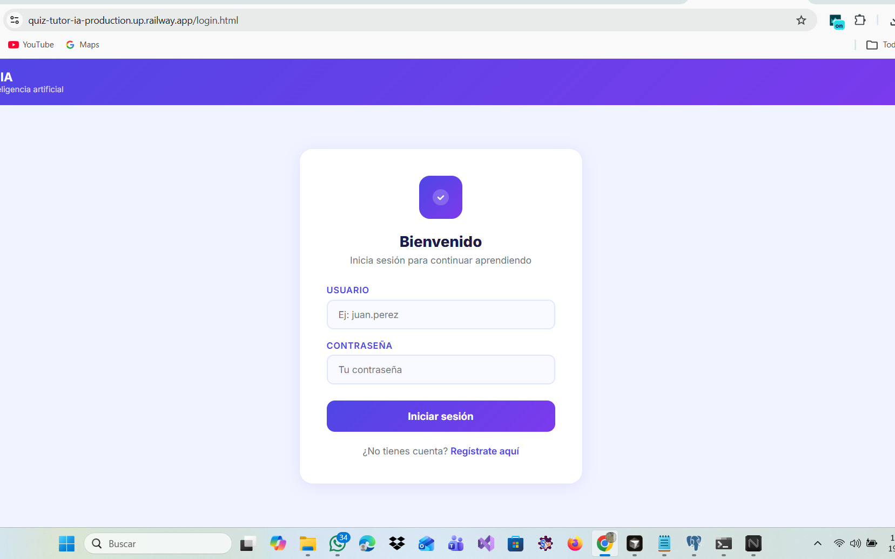
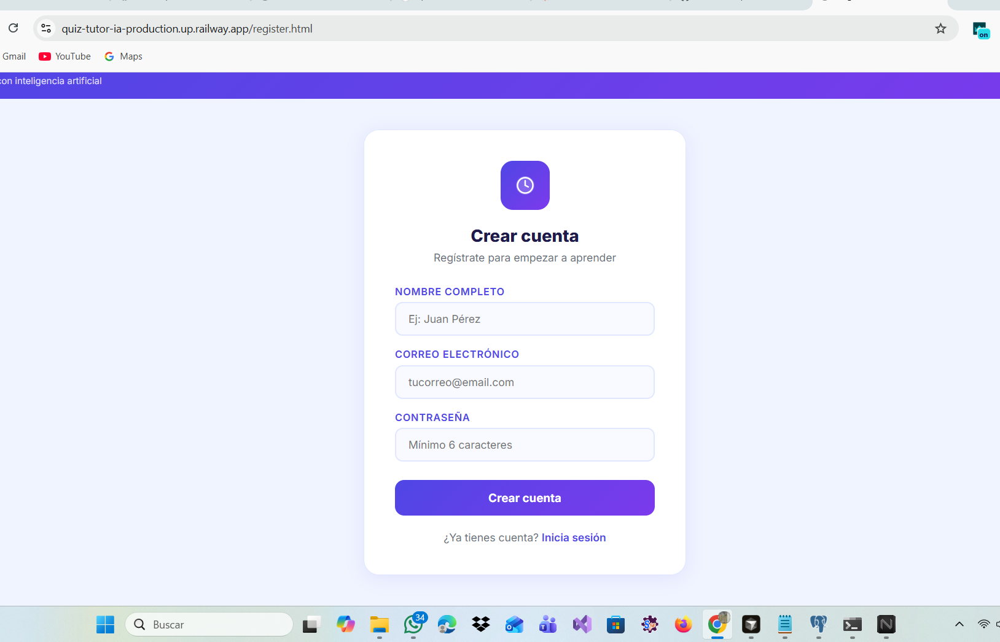

#### 🎯 Quiz System
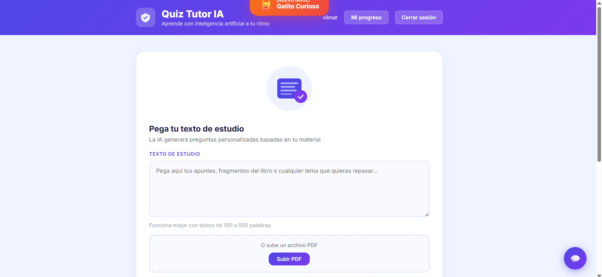
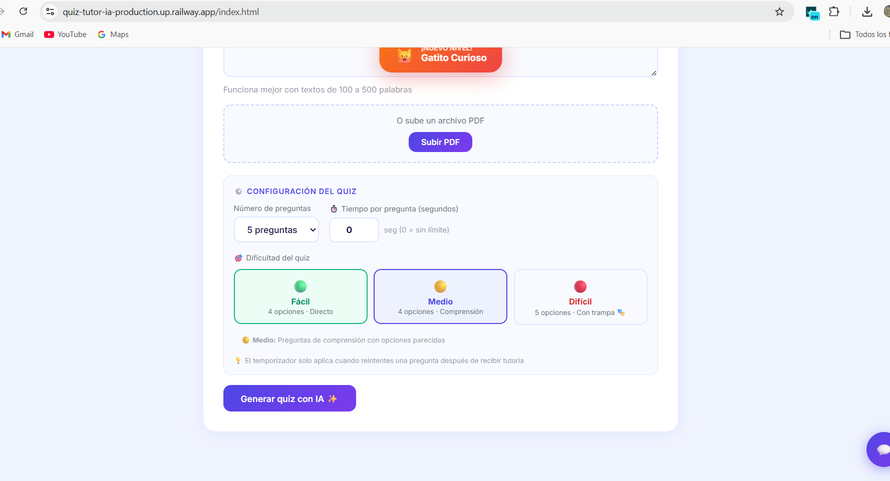
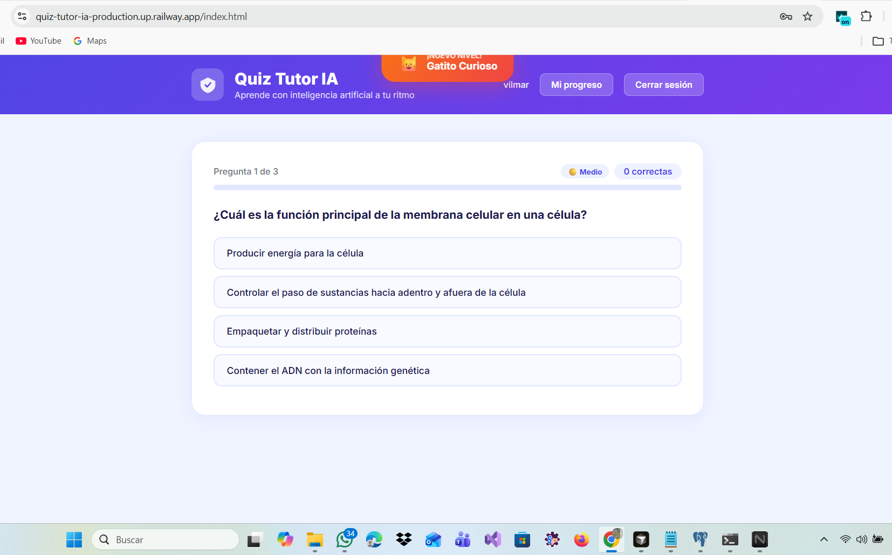

#### 📚 AI Learning
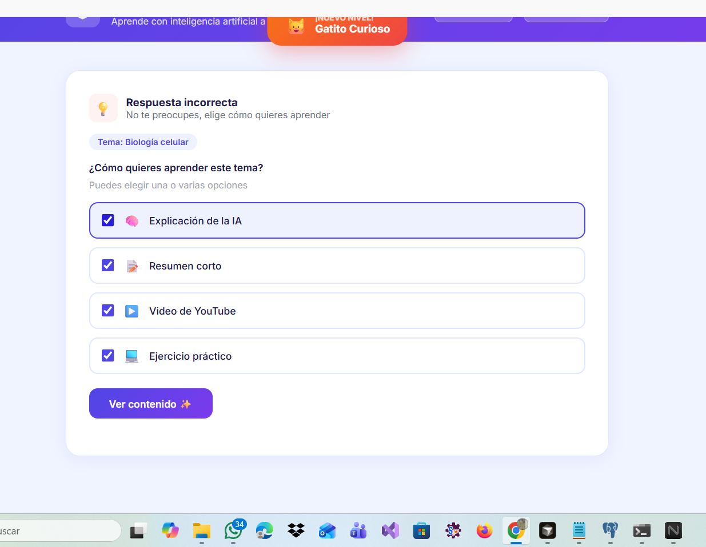


#### 📊 Dashboard & Progress
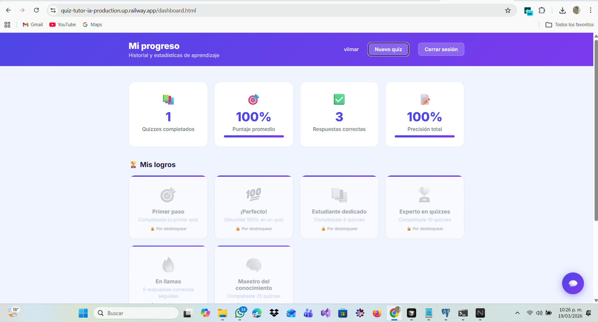
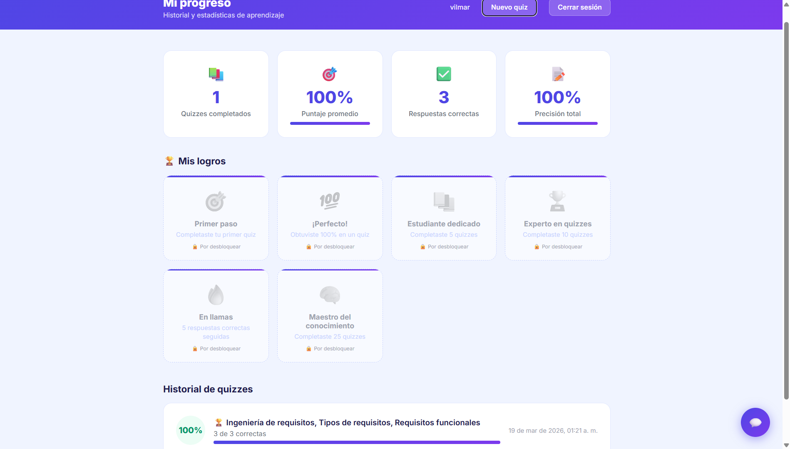

#### 💬 AI Assistant & Features
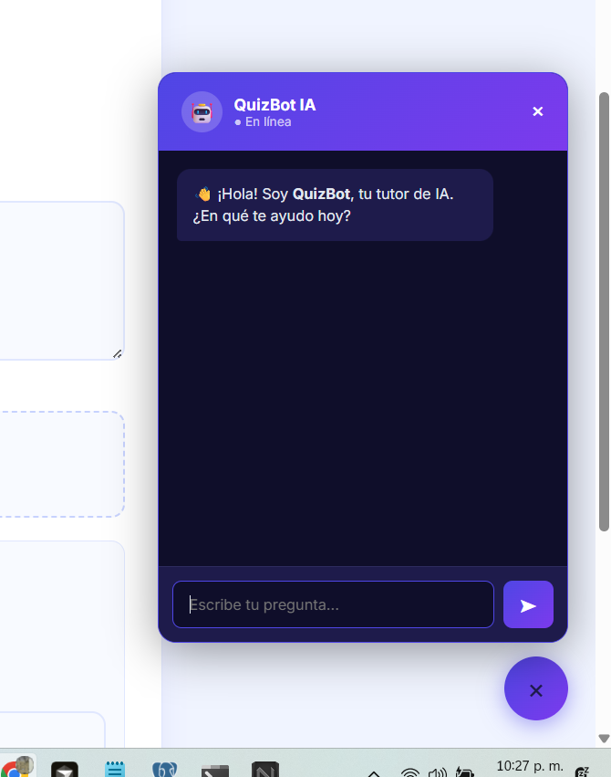
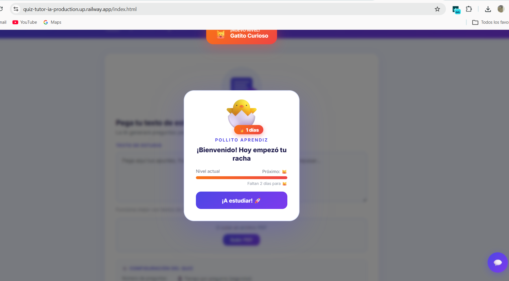
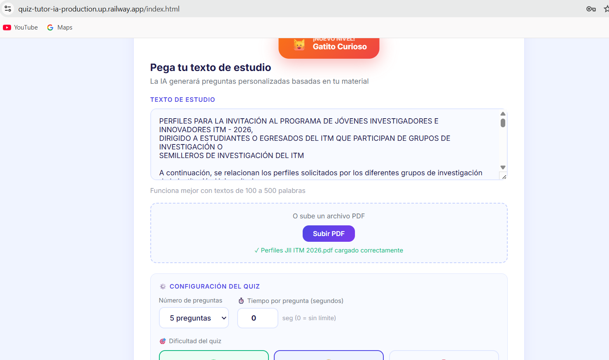

---

### 🛠️ Tech Stack

**Backend**
- Java 17
- Spring Boot 3.5
- Spring Security + JWT
- JPA / Hibernate
- Maven

**Database**
- PostgreSQL 18
- pgAdmin 4

**AI**
- Groq API (LLaMA 3.3 70B)
- PDFBox (PDF text extraction)

**Frontend**
- HTML5 + CSS3 + JavaScript (Vanilla)
- Chart.js (progress charts)

**DevOps**
- Railway (cloud deploy)
- Git + GitHub

---

### 🚀 Getting Started

#### Prerequisites
- Java 17+
- Maven 3.9+
- PostgreSQL
- Groq API Key (free): [console.groq.com](https://console.groq.com)

#### Environment Variables
```bash
SPRING_DATASOURCE_URL=jdbc:postgresql://localhost:5432/quiz_tutor_db
SPRING_DATASOURCE_USERNAME=postgres
SPRING_DATASOURCE_PASSWORD=your_password
JWT_SECRET=yourSecretKey123
GROQ_API_KEY=your_groq_api_key
PORT=8080
```

#### Run Locally (PowerShell)
```powershell
# 1. Clone the repository
git clone https://github.com/vilmarrivasperea/quiz-tutor-ia.git
cd quiz-tutor-ia/quiz-tutor

# 2. Create database in PostgreSQL
# CREATE DATABASE quiz_tutor_db;

# 3. Set environment variables
$env:SPRING_DATASOURCE_URL="jdbc:postgresql://localhost:5432/quiz_tutor_db"
$env:SPRING_DATASOURCE_USERNAME="postgres"
$env:SPRING_DATASOURCE_PASSWORD="your_password"
$env:JWT_SECRET="yourSecretKey123"
$env:GROQ_API_KEY="your_groq_api_key"
$env:PORT="8080"

# 4. Run
mvn spring-boot:run
```

#### Access
```
http://localhost:8080          → Main app
http://localhost:8080/login.html    → Login
http://localhost:8080/register.html → Register
http://localhost:8080/dashboard.html → Dashboard
```

---

### 📡 API Endpoints

| Method | Endpoint | Description |
|---|---|---|
| POST | `/api/auth/register` | Register new user |
| POST | `/api/auth/login` | Login |
| POST | `/api/quiz/generate` | Generate quiz from text |
| POST | `/api/quiz/learn` | Get learning content |
| GET | `/api/dashboard` | Get progress & history |
| POST | `/api/dashboard/guardar` | Save quiz result |
| POST | `/api/pdf/extraer` | Extract text from PDF |
| POST | `/api/chat/mensaje` | Chat with QuizBot AI |
| GET | `/api/logros` | Get achievements |
| GET | `/api/racha` | Get daily streak |
| POST | `/api/racha/actualizar` | Update daily streak |

---

### 👨‍💻 Developer

**Vilmar Rivasperea**
Student — Software Analysis and Development Technology
Instituto Tecnológico Metropolitano — Medellín, Colombia 🇨🇴

[](https://www.linkedin.com/in/vilmar-rivas-344834320/)
[](https://github.com/vilmarrivasperea)
[](https://vilmarrivasperea.github.io)
[](mailto:rivaspereavilmar@gmail.com)

---

---

## 🇨🇴 Español

### 📖 Descripción

Quiz Tutor IA es una aplicación web educativa fullstack que genera quizzes inteligentes de opción múltiple a partir de cualquier texto de estudio o archivo PDF. Cuando el estudiante falla una pregunta, puede elegir cómo quiere aprender el tema: explicación de la IA, resumen corto, video de YouTube o ejercicio práctico.

Desarrollado con **Java 17 + Spring Boot** en el backend y **HTML/CSS/JS vanilla** en el frontend, desplegado en **Railway** con **PostgreSQL**.

---

### ✨ Funcionalidades

| Funcionalidad | Descripción |
|---|---|
| 🤖 **Generación de Quiz con IA** | Genera preguntas personalizadas de opción múltiple usando Groq LLaMA 3 |
| 📄 **Subida de PDF** | Sube tus apuntes en PDF y extrae el texto automáticamente con PDFBox |
| 🎯 **3 Niveles de Dificultad** | Fácil (4 opciones), Medio (4 opciones), Difícil (5 opciones con trampa de otro tema) |
| ⏱️ **Temporizador Configurable** | Define el tiempo por pregunta (0–600 segundos), se activa al reintentar |
| 💬 **Chat con IA (QuizBot)** | Chatbot flotante con Groq — pregunta sobre cualquier tema académico |
| 🏆 **Sistema de Logros** | Desbloquea badges al completar quizzes y mejorar tus puntajes |
| 🔥 **Racha Diaria** | Sistema de avatares (🐣→🐱→🦊→🐺→🦁→🐉) que evoluciona con días consecutivos de estudio |
| 📈 **Gráfica de Evolución** | Línea de tiempo con la evolución de tus puntajes |
| 🔐 **Autenticación JWT** | Login y registro seguros con BCrypt + tokens JWT |
| ☁️ **Deploy en la Nube** | Live en Railway con base de datos PostgreSQL |

---

### 📸 Capturas de Pantalla

#### 🔐 Login y Registro


#### 🎯 Sistema de Quiz


#### 📚 Aprendizaje con IA


#### 📊 Dashboard y Progreso


#### 💬 Asistente IA y Funcionalidades


---

### 🛠️ Tecnologías

**Backend**
- Java 17
- Spring Boot 3.5
- Spring Security + JWT
- JPA / Hibernate
- Maven

**Base de Datos**
- PostgreSQL 18
- pgAdmin 4

**Inteligencia Artificial**
- Groq API (LLaMA 3.3 70B)
- PDFBox (extracción de texto de PDFs)

**Frontend**
- HTML5 + CSS3 + JavaScript (Vanilla)
- Chart.js (gráficas de progreso)

**DevOps**
- Railway (deploy en la nube)
- Git + GitHub

---

### 🚀 Instalación Local

#### Requisitos
- Java 17+
- Maven 3.9+
- PostgreSQL
- Clave de API de Groq (gratis): [console.groq.com](https://console.groq.com)

#### Variables de Entorno
```bash
SPRING_DATASOURCE_URL=jdbc:postgresql://localhost:5432/quiz_tutor_db
SPRING_DATASOURCE_USERNAME=postgres
SPRING_DATASOURCE_PASSWORD=tu_contraseña
JWT_SECRET=tuClaveSecreta123
GROQ_API_KEY=tu_clave_groq
PORT=8080
```

#### Correr Localmente (PowerShell)
```powershell
# 1. Clonar el repositorio
git clone https://github.com/vilmarrivasperea/quiz-tutor-ia.git
cd quiz-tutor-ia/quiz-tutor

# 2. Crear base de datos en PostgreSQL
# CREATE DATABASE quiz_tutor_db;

# 3. Configurar variables de entorno
$env:SPRING_DATASOURCE_URL="jdbc:postgresql://localhost:5432/quiz_tutor_db"
$env:SPRING_DATASOURCE_USERNAME="postgres"
$env:SPRING_DATASOURCE_PASSWORD="tu_contraseña"
$env:JWT_SECRET="tuClaveSecreta123"
$env:GROQ_API_KEY="tu_clave_groq"
$env:PORT="8080"

# 4. Correr
mvn spring-boot:run
```

#### Acceder
```
http://localhost:8080               → App principal
http://localhost:8080/login.html    → Iniciar sesión
http://localhost:8080/register.html → Registrarse
http://localhost:8080/dashboard.html → Mi progreso
```

---

### 📡 Endpoints de la API

| Método | Endpoint | Descripción |
|---|---|---|
| POST | `/api/auth/register` | Registrar nuevo usuario |
| POST | `/api/auth/login` | Iniciar sesión |
| POST | `/api/quiz/generate` | Generar quiz desde texto |
| POST | `/api/quiz/learn` | Obtener contenido de aprendizaje |
| GET | `/api/dashboard` | Obtener historial y estadísticas |
| POST | `/api/dashboard/guardar` | Guardar resultado de quiz |
| POST | `/api/pdf/extraer` | Extraer texto de PDF |
| POST | `/api/chat/mensaje` | Chatear con QuizBot IA |
| GET | `/api/logros` | Obtener logros del usuario |
| GET | `/api/racha` | Obtener racha diaria |
| POST | `/api/racha/actualizar` | Actualizar racha diaria |

---

### 👨‍💻 Desarrollador

**Vilmar Rivasperea**
Estudiante — Tecnología en Análisis y Desarrollo de Software
Instituto Tecnológico Metropolitano — Medellín, Colombia 🇨🇴
2026

[](https://www.linkedin.com/in/vilmar-rivas-344834320/)
[](https://github.com/vilmarrivasperea)
[](https://vilmarrivasperea.github.io)
[](mailto:rivaspereavilmar@gmail.com)

---

<div align="center">
Desarrollado con ❤️ y mucho café ☕ — Medellín, Colombia 🇨🇴
</div>
